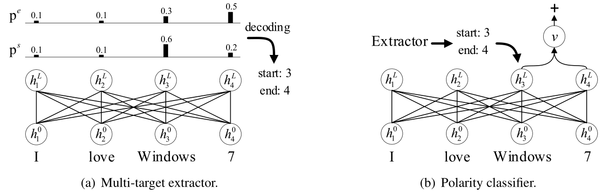

# Open-Domain Targeted Sentiment Analysis via Span-Based Extraction and Classification

This repo contains the code and data of the following paper:

<i> "Open-Domain Targeted Sentiment Analysis via Span-Based Extraction and Classification". Minghao Hu, Yuxing Peng, Zhen Huang, Dongsheng Li, Yiwei Lv. ACL 2019.</i>

In this paper, we propose a span-based extract-then-classify framework for the open-domain targeted sentiment analysis task, which is shown as below:
<p>

</p>

This framework consists of two components:
- Multi-target extractor
- Polarity classifier

Both of two components utilize [BERT](https://github.com/huggingface/pytorch-pretrained-BERT) as backbone network. The multi-target extractor aims to propose one or multiple candidate targets based on the probabilities of the start and end positions. The polarity classifier predicts the sentiment polarity using the span representation of the given target.

## Requirements
- Python 3.6
- [Pytorch 1.1](https://pytorch.org/)
- [Allennlp](https://allennlp.org/)

Download the uncased [BERT-Base](https://drive.google.com/file/d/13I0Gj7v8lYhW5Hwmp5kxm3CTlzWZuok2/view?usp=sharing) model and unzip it in the current directory. 

Run the following commands to set up environments:
```bash
export DATA_DIR=data/absa
export BERT_DIR=bert-base-uncased
```

## Multi-target extractor
Train the multi-target extractor:
```shell
python -m absa.run_extract_span \
  --vocab_file $BERT_DIR/vocab.txt \
  --bert_config_file $BERT_DIR/bert_config.json \
  --init_checkpoint $BERT_DIR/pytorch_model.bin \
  --do_train \
  --do_predict \
  --data_dir $DATA_DIR \
  --train_file rest_total_train.txt \
  --predict_file rest_total_test.txt \
  --train_batch_size 32 \
  --output_dir out/extract/01
```

## Polarity classifier
Train the polarity classifier:
```shell
python -m absa.run_cls_span \
  --vocab_file $BERT_DIR/vocab.txt \
  --bert_config_file $BERT_DIR/bert_config.json \
  --init_checkpoint $BERT_DIR/pytorch_model.bin \
  --do_train \
  --do_predict \
  --data_dir $DATA_DIR \
  --train_file rest_total_train.txt \
  --predict_file rest_total_test.txt \
  --train_batch_size 32 \
  --output_dir out/cls/01
```

## Pipelined method
Once the above two components have been trained, we can construct a pipeline system by running the following command:
```shell
python -m absa.run_extract_span  \
  --vocab_file $BERT_DIR/vocab.txt \
  --bert_config_file $BERT_DIR/bert_config.json \
  --do_pipeline \
  --data_dir $DATA_DIR \
  --predict_file rest_total_test.txt \
  --logit_threshold 9.5 \
  --output_dir out/extract/01

python -m absa.run_cls_span \
  --vocab_file $BERT_DIR/vocab.txt \
  --bert_config_file $BERT_DIR/bert_config.json \
  --do_pipeline \
  --data_dir $DATA_DIR \
  --predict_file rest_total_test.txt \
  --output_dir out/cls/01 \
  --extraction_file out/extract/01/extraction_results.pkl
```
The predicted results will be saved into a file called `predictions.json` in the `output_dir`:
```bash
cat out/cls/01/predictions.json
```

The test performance is shown in a file called `performance.txt` in the `output_dir`:
```bash
cat out/cls/01/performance.txt
```
Which should produce an output like this:
```bash
pipeline, step: 210, P: 0.6991, R: 0.7156, F1: 0.7073 (common: 1638.0, retrieved: 2343.0, relevant: 2289.0)
```

If you train with the `BERT-Large` model, you should see a result similar to 74.9 F1 reported in the paper (The `logit_threshold` is set as 12).

## Joint method
You can also try to run the joint method, which jointly train both the multi-target extractor and the polarity classifier:
```shell
python -m absa.run_joint_span \
  --vocab_file $BERT_DIR/vocab.txt \
  --bert_config_file $BERT_DIR/bert_config.json \
  --init_checkpoint $BERT_DIR/pytorch_model.bin \
  --do_train \
  --do_predict \
  --data_dir $DATA_DIR \
  --train_file rest_total_train.txt \
  --predict_file rest_total_test.txt \
  --train_batch_size 32 \
  --logit_threshold 8.0 \
  --output_dir out/joint/01
```

This will produce a result like this:
```bash
threshold: 8.0, step: 234, P: 0.7192, R: 0.6514, F1: 0.6836 (common: 1491.0, retrieved: 2073.0, relevant: 2289.0)
```

## Acknowledgements
We sincerely thank Xin Li for releasing the [datasets](https://github.com/lixin4ever/E2E-TBSA).

If you find the paper or this repository helpful in your work, please use the following citation:
```
@inproceedings{hu2019open,
  title={Open-Domain Targeted Sentiment Analysis via Span-Based Extraction and Classification},
  author={Hu, Minghao and Peng, Yuxing and Huang, Zhen and Li, Dongsheng and Lv, Yiwei},
  booktitle={ACL},
  year={2019}
}
```
